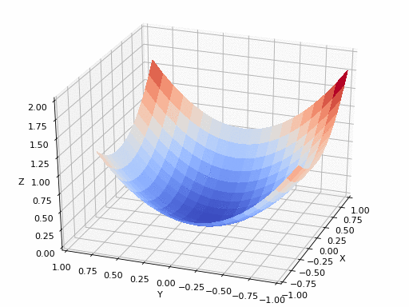
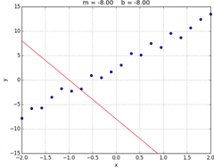

# Visualization of Gradient Descent algorithm based on Linear Regression problem

#### 1. Data

- load a set of data points $`\{ (x^{(i)}, y^{(i)}) \}`$ from the given CSV file (data.csv)

#### 2. Linear Model

- $`h_\theta(x) = \theta_0 + \theta_1 x`$, $`\quad`$ where $`\theta = (\theta_0, \theta_1)`$ and $`\theta_0, \theta_1 \in \mathbb{R}`$

#### 3. Objective Function

- $`J(\theta_0, \theta_1) = \frac{1}{2 m} \sum_{i=1}^m ( \theta_0 + \theta_1 x^{(i)} - y^{(i)} )^2`$

#### 4. Gradient Descent
 
- $`\theta_0^{(t+1)} \coloneqq \theta_0^{(t)} - \alpha \frac{1}{m} \sum_{i=1}^{m} (h_\theta(x^{(i)}) - y^{(i)})`$
- $`\theta_1^{(t+1)} \coloneqq \theta_1^{(t)} - \alpha \frac{1}{m} \sum_{i=1}^{m} (h_\theta(x^{(i)}) - y^{(i)}) x^{(i)}`$

#### 5. Energy Surface

- three dimentional surface by $`(\theta_0, \theta_1, J(\theta_0, \theta_1))`$




## Code

- load CSV file

``` python
import numpy as np
import matplotlib.pyplot as plt

path = "data.csv"
data = np.genfromtxt(path, delimiter=',')

x_data = data[:, 0]
y_data = data[:, 1]

plt.figure(figsize=(8, 8))
plt.scatter(x_data, y_data, alpha=0.3)
plt.show()
```
 
## Submission

### 1. Codes, Comments and Results

_PDF file that is exported from Notebook including codes, comments, and results for the above problem using Jupyter Notebook or Colab_

#### [Plotting the results]

##### 1. Input points [2pt]
- plot a set of points $`\{ (x^{(i)}, y^{(i)}) \}`$ that are loaded from 'data.csv' file (in black color)

##### 2. linear regression result [3pt]
- plot a set of points $`\{ (x^{(i)}, y^{(i)}) \}`$ that are loaded from 'data.csv' file (in black color)
- plot a straight line obtained by the optimal linear regression based on the given set of points (in red color)
- the estimated straight line (linear function) is superimposed on the set of points

##### 3. Plot the energy surface [4pt]
- plot the energy surface $`(\theta_0, \theta_1, J(\theta_0, \theta_1)`$ with the range of variables $`\theta_0 = [-30 : 0.1 : 30]`$ and $`\theta_1 = [-30 : 0.1 : 30]`$

##### 4. Plot the gradient descent path on the energy surface [5pt]
- plot the energy surface $`(\theta_0, \theta_1, J(\theta_0, \theta_1)`$ with the range of variables $`\theta_0 = [-30 : 0.1 : 30]`$ and $`\theta_1 = [-30 : 0.1 : 30]`$
- plot the energy value with the updated variables $`\theta_0^{(t)}`$ and $`\theta_1^{(t)}`$ at each gradient descent step on the energy surface
- the initial condition is used by $`\theta_0^{(0)} = -30`$ and $`\theta_1^{(0)} = -30`$ 
- the gradient descent is performed until the convergence is achieved
- the gradient descent path is superimposed on the energy surface

### 2. Commit History

_PDF file that is exported from the commit history at github_

#### [Apply `commit` at the end of the implementations at least for the following steps]

You can `commit` as many as you want and the order of commits does not matter, but you have to make meaningful and proper comments for commit messages

1. Plotting the input data [1pt]
2. Plotting the linear regression result [1pt]
3. Plotting the energy surface [1pt]
4. Plotting the optimization path [1pt]
