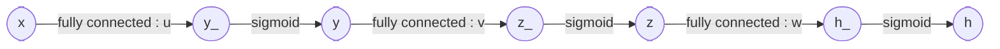

# Multi-label classification using neural networks

#### 1. Input Data

- load the data file ('mnist.csv')
- each row of the data consists of the label $`l`$ and the image pixel values $`x`$ in a vector form
- the label is one of the 10 digits from 0 to 9, $`l \in [0, 9]`$
- the image represents its associated label in the grey scale
- the number of images is 10,000 and the size of each image is 28x28, $`x \in \mathbb{R}^{784}`$
- consider the first 6,000 images for training and the rest 4,000 images for testing
- normalise the intensity values of each image so that they ranges from 0 to 1

#### 2. Neural Network Architecture




- build a neural network for the multi-label classification with 10 labels
- construct a neural network with 4 layers including the input layer and the output layer
- each hidden layer is defined by a logistic unit
- a logistic unit consists of a fully connected layer with a bias followed by the sigmoid activation function 
- the dimension of each layer is defined by:
    - input layer : 784 (+ a bias)
    - first hidden layer : 196 (+ a bias)
    - second hidden layer : 49 (+ a bias)
    - output layer : 10

#### 2. Sigmoid function as an activation function

- $`\sigma(z) = \frac{1}{1 + \exp(-z)}`$
- $`\sigma^{\prime}(z) = \sigma(z) (1 - \sigma(z))`$

#### 3. Objective Function

- $`J(\theta) = \frac{1}{m} \sum_{i=1}^m \sum_{k=0}^{9}( - l^{(i)}_k \log( h^{(i)}_k ) - (1 - l^{(i)}_k) \log(1 - h^{(i)}_k) )`$
- $`\theta = (u, v, w)`$
- $`h^{(i)}_k`$ denotes the $`k`$-th element of the output layer for $`i`$-th sample data

#### 4. Gradient Descent (Back-propagation)

- $`\theta_{k}^{(t+1)} \coloneqq \theta_{k}^{(t)} - \alpha \frac{\partial J(\theta^{(t)})}{\partial \theta_{k}}`$, for all $`k`$
- you should choose a learning rate $`\alpha`$ in such a way that the convergence is achieved
- you can use random initial conditions $`\theta_k^{(0)}`$ for all $`k`$ following a normal distribution with mean 0 and stardard deviation some number
 
#### 5. Training

- find optimal parameters $`\theta`$ using the training data

#### 6. Testing

- apply the obtained $`\theta`$ from the training process using the testing data

#### 7. Determination of class

- $`l^* = \arg\max_k h_k`$
- the label is determined by the index of the maximum value at the output of the network for testing

#### 8. Compute the accuracy

- the accuracy is computed by $`\frac{\textrm{number of correct predictions}}{\textrm{total number of predictions}}`$

## Code

- load the data from the file and plot the images

``` python
import matplotlib.pyplot as plt
import numpy as np

file_data   = "mnist.csv"
handle_file = open(file_data, "r")
data        = handle_file.readlines()
handle_file.close()

size_row    = 28    # height of the image
size_col    = 28    # width of the image

num_image   = len(data)
count       = 0     # count for the number of images

#
# normalize the values of the input data to be [0, 1]
#
def normalize(data):

    data_normalized = (data - min(data)) / (max(data) - min(data))

    return(data_normalized)

#
# example of distance function between two vectors x and y
#
def distance(x, y):

    d = (x - y) ** 2
    s = np.sum(d)
    # r = np.sqrt(s)

    return(s)

#
# make a matrix each column of which represents an images in a vector form
#
list_image  = np.empty((size_row * size_col, num_image), dtype=float)
list_label  = np.empty(num_image, dtype=int)

for line in data:

    line_data   = line.split(',')
    label       = line_data[0]
    im_vector   = np.asfarray(line_data[1:])
    im_vector   = normalize(im_vector)

    list_label[count]       = label
    list_image[:, count]    = im_vector

    count += 1

#
# plot first 150 images out of 10,000 with their labels
#
f1 = plt.figure(1)

for i in range(150):

    label       = list_label[i]
    im_vector   = list_image[:, i]
    im_matrix   = im_vector.reshape((size_row, size_col))

    plt.subplot(10, 15, i+1)
    plt.title(label)
    plt.imshow(im_matrix, cmap='Greys', interpolation='None')

    frame   = plt.gca()
    frame.axes.get_xaxis().set_visible(False)
    frame.axes.get_yaxis().set_visible(False)


#plt.show()

#
# plot the average image of all the images for each digit
#
f2 = plt.figure(2)

im_average  = np.zeros((size_row * size_col, 10), dtype=float)
im_count    = np.zeros(10, dtype=int)

for i in range(num_image):

    im_average[:, list_label[i]] += list_image[:, i]
    im_count[list_label[i]] += 1

for i in range(10):

    im_average[:, i] /= im_count[i]

    plt.subplot(2, 5, i+1)
    plt.title(i)
    plt.imshow(im_average[:,i].reshape((size_row, size_col)), cmap='Greys', interpolation='None')

    frame   = plt.gca()
    frame.axes.get_xaxis().set_visible(False)
    frame.axes.get_yaxis().set_visible(False)

plt.show()
```

## Submission

### 1. Codes, Comments and Results

_PDF file that is exported from Notebook including codes, comments, and results for the above problem using Jupyter Notebook or Colab_

##### 0. Optimization
- the optimization should be performed until convergence
- the random initial condition is applied to the model parameters following a normal distribution with mean 0 and standard deviation some number
- an appropriate value should be used for the learning rate to achieve convergence
- it is allowed to schedule learning rate according to the optimization iterations
- efficient matrix computation can be performed using GPU
- do not use any machine learning library to compute gradient descent
- you have to compute the gradient for the model parameters using your own codes

##### 1. Plot the loss curve
- plot the training loss at every iteration of gradient descent using the training data in blue color (the first 6,000 images) [5pt]
- plot the testing loss at every iteration of gradient descent using the testing data in red color (the rest 4,000 images) [5pt]
- the both curves should be presented in one figure

##### 2. Plot the accuracy curve
- plot the training accuracy (%) at every iteration of gradient descent using the training data in blue color (the first 6,000 images) [5pt]
- plot the testing accuracy (%) at every iteration of gradient descent using the testing data in red color (the rest 4,000 images) [5pt]
- the both curves should be presented in one figure

##### 3. Plot the accuracy value
- print the final training accuracy (%) using the training data (the first 6,000 images) [2pt]
- print the final testing accuracy (%) using the testing data (the rest 4,000 images) [2pt]

##### 4. Plot the classification example
- present 10 correctly classified testing images with their labels at the title of each sub-figure in 2x5 array [5pt]
- present 10 misclassified testing images with their misclassified labels at the title of each sub-figure in 2x5 array [5pt]

### 2. Commit History [1pt]

_PDF file that is exported from the commit history at github_

You should `git commit` at least 4 times with meaningful and proper commit messages in such a way that you can demonstrate the progress of your programming in an effective way