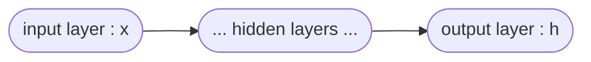

# Multi-label classification using neural networks with a regularization

#### 1. Input Data

- load the data file ('mnist.csv')
- each row of the data consists of the label $`l`$ and the image pixel values $`x`$ in a vector form
- the label is one of the 10 digits from 0 to 9, $`l \in [0, 9]`$
- the image represents its associated label in the grey scale
- the number of images is 10,000 and the size of each image is 28x28, $`x \in \mathbb{R}^{784}`$
- consider the first `1,000` images for `training` and the rest `9,000` images for `testing`
- normalise the intensity values of each image so that they ranges from 0 to 1

#### 2. Neural Network Architecture

- build a neural network for the multi-label classification with 10 labels
- construct a neural network that consists of an input layer, an output layer and a sequence of hidden layers
- each hidden layer is defined by a logistic unit
- a logistic unit consists of a fully connected layer with a bias followed by the sigmoid activation function 
- the dimensions of the input layer and the output layer are defined by:
    - input unit : 784 (+ a bias)
    - output unit : 10
- you can use determine the dimension of each hidden layer as you want

#### 2. Sigmoid function as an activation function

- $`\sigma(z) = \frac{1}{1 + \exp(-z)}`$
- $`\sigma^{\prime}(z) = \sigma(z) (1 - \sigma(z))`$

#### 3. Objective Function

- $`J(\theta) = \frac{1}{m} \sum_{i=1}^m \sum_{k=0}^{9}( - l^{(i)}_k \log( h^{(i)}_k ) - (1 - l^{(i)}_k) \log(1 - h^{(i)}_k) ) + \frac{\lambda}{2 n} \sum_{j=1}^n \theta_j^2`$ 
- $`\theta_j`$ denotes a model parameter where $`j = 1, 2, \cdots, n`$
- $`\lambda`$ is a control parameter for the regularization based on the $`L_2^2`$-norm (weight decay)
- $`n`$ is the total number of all the model parameters over the entire neural network
- $`h^{(i)}_k`$ denotes the $`k`$-th element of the output layer for $`i`$-th sample data

#### 4. Gradient Descent (Back-propagation)

- $`\theta_{k}^{(t+1)} \coloneqq \theta_{k}^{(t)} - \alpha \frac{\partial J(\theta^{(t)})}{\partial \theta_{k}}`$, for all $`k`$
- you should choose a learning rate $`\alpha`$ in such a way that the convergence is achieved
- you can use random initial conditions $`\theta_k^{(0)}`$ for all $`k`$ following a normal distribution with mean 0 and stardard deviation some number
 
#### 5. Training

- find optimal parameters $`\theta`$ using the training data

#### 6. Testing

- apply the obtained $`\theta`$ from the training process using the testing data

#### 7. Determination of class

- $`l^* = \arg\max_k h_k`$
- the label is determined by the index of the maximum value at the output of the network for testing

#### 8. Compute the accuracy

- the accuracy is computed by $`\frac{\textrm{number of correct predictions}}{\textrm{total number of predictions}}`$

#### 9. Regularization

- you can choose a value for the regularization parameter $`\lambda`$ in such a way that the best `testing accuracy` can be achieved

## Submission

### 1. Codes, Comments and Results

_PDF file that is exported from Notebook including codes, comments, and results for the above problem using Jupyter Notebook or Colab_

##### 0. Optimization
- the optimization should be performed until convergence
- the random initial condition is applied to the model parameters following a normal distribution with mean 0 and standard deviation some number
- an appropriate value should be used for the learning rate to achieve convergence
- it is allowed to schedule learning rate according to the optimization iterations
- efficient matrix computation can be performed using GPU
- do not use any machine learning library to compute gradient descent
- you have to compute the gradient for the model parameters using your own codes

##### 1. Plot the loss curve
- plot the training loss at every iteration of gradient descent using the training data in blue color [3pt]
- plot the testing loss at every iteration of gradient descent using the testing data in red color [3pt]
- the both curves should be presented in one figure

##### 2. Plot the accuracy curve
- plot the training accuracy (%) at every iteration of gradient descent using the training data in blue color [3pt]
- plot the testing accuracy (%) at every iteration of gradient descent using the testing data in red color [3pt]
- the both curves should be presented in one figure

##### 3. Plot the accuracy value
- print the final training accuracy (%) using the training data [1pt]
- print the final testing accuracy (%) using the testing data [1pt]

##### 4. Plot the classification example
- present 10 correctly classified testing images with their labels at the title of each sub-figure in 2x5 array [3pt]
- present 10 misclassified testing images with their misclassified labels at the title of each sub-figure in 2x5 array [3pt]

##### 5. `Testing` accuracy [20pt]
- the score will not be given when the above `1. Plot the loss curve` and `2. Plot the accuracy curve` are not perfectly done (both should get 6 pt)
- the rank will be determined based on the `testing accuracy` and the score will be given as below:
    - rank 001 - 010 : 20pt
    - rank 011 - 020 : 15pt
    - rank 021 - 030 : 11pt
    - rank 031 - 040 : 08pt
    - rank 041 - 100 : 06pt

### 2. Commit History [1pt]

_PDF file that is exported from the commit history at github_

You should `git commit` at least 4 times with meaningful and proper commit messages in such a way that you can demonstrate the progress of your programming in an effective way