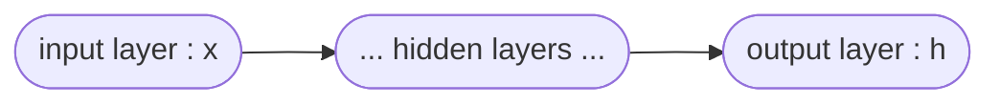
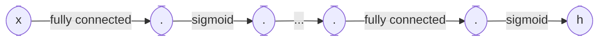

# Text classification using neural networks

This assignment aims to build a binary classifier for text data based on neural networks. The classifier is designed to classify input review text data into positive or negative.

#### 1. Text Data

- the data directory ('movie_review') consists of two sub-directories ('pos') and ('neg') for positive and negative, respectively
- each sub-directory includes a list of files for review texts
- the preprocessing given by the below codes transforms each text into the frequency information

#### 2. Neural Networks Architecture





- build a classifier using neural networks for the text cateogrization with binary labels that are either positive or negative
- construct a neural network that consists of an input layer, an output layer and a sequence of hidden layers
- each hidden layer is defined by a logistic unit
- a logistic unit consists of a fully connected layer with a bias followed by the sigmoid activation function 
- you are allowed to determine the number of hidden layers and their dimensions as you want

#### 3. Sigmoid function as an activation function

- $`\sigma(z) = \frac{1}{1 + \exp(-z)}`$
- $`\sigma^{\prime}(z) = \sigma(z) (1 - \sigma(z))`$

#### 4. Objective Function

- $`J(\theta) = \frac{1}{m} \sum_{i=1}^m ( - l^{(i)} \log( h^{(i)} ) - (1 - l^{(i)}) \log(1 - h^{(i)}) ) + \frac{\lambda}{2 n} \sum_{j=1}^n \theta_j^2`$ 
- $`\theta_j`$ denotes a model parameter where $`j = 1, 2, \cdots, n`$
- $`\lambda`$ is a control parameter for the regularization based on the $`L_2^2`$-norm (weight decay)
- $`n`$ is the total number of all the model parameters over the entire neural network
- $`h^{(i)}`$ denotes the output layer for $`i`$-th sample data

#### 5. Gradient Descent (Back-propagation)

- $`\theta_{j}^{(t+1)} \coloneqq \theta_{j}^{(t)} - \alpha \frac{\partial J(\theta^{(t)})}{\partial \theta_{j}}`$, for all $`j`$
- you should choose a learning rate $`\alpha`$ in such a way that the convergence is achieved
- you can use random initial conditions $`\theta_j^{(0)}`$ for all $`j`$ following a normal distribution with mean 0 and stardard deviation some number

#### 6. Codes for Data Preprocessing

- the data preprocessing steps aim to transform text data into informative quantity with respect to the class
- it is allowed to use any embedding scheme to trainsform text data into descriptors using any libraries
- the classified should be developed by your own codes (use of library is not allowed)

```python
import numpy as np
import re
import nltk
from sklearn.datasets import load_files
nltk.download('stopwords')
nltk.download('wordnet')
import pickle
from nltk.corpus import stopwords
from nltk.stem import WordNetLemmatizer
from sklearn.feature_extraction.text import CountVectorizer
from sklearn.feature_extraction.text import TfidfTransformer
from sklearn.model_selection import train_test_split


review_data = load_files(r"movie_review")
X, y = review_data.data, review_data.target

documents = []

stemmer = WordNetLemmatizer()

for sen in range(0, len(X)):
    # Remove all the special characters
    document = re.sub(r'\W', ' ', str(X[sen]))
    
    # remove all single characters
    document = re.sub(r'\s+[a-zA-Z]\s+', ' ', document)
    
    # Remove single characters from the start
    document = re.sub(r'\^[a-zA-Z]\s+', ' ', document) 
    
    # Substituting multiple spaces with single space
    document = re.sub(r'\s+', ' ', document, flags=re.I)
    
    # Removing prefixed 'b'
    document = re.sub(r'^b\s+', '', document)
    
    # Converting to Lowercase
    document = document.lower()
    
    # Lemmatization
    document = document.split()
    document = [stemmer.lemmatize(word) for word in document]
    document = ' '.join(document)
    
    documents.append(document)

vectorizer = CountVectorizer(max_features=1500, min_df=5, max_df=0.7, stop_words=stopwords.words('english'))
X = vectorizer.fit_transform(documents).toarray()

tfidfconverter = TfidfTransformer()
X = tfidfconverter.fit_transform(X).toarray()

X_train, X_test, y_train, y_test = train_test_split(X, y, test_size=0.3, shuffle=False)
```

- [Tutorial for `load_files`](https://scikit-learn.org/stable/modules/generated/sklearn.datasets.load_files.html)
- [Tutorial for `stopwords`](https://pythonspot.com/nltk-stop-words/)
- [Tutorial for `WordNetLemmatizer`](https://www.datacamp.com/community/tutorials/stemming-lemmatization-python)
- [Tutorial for `Regex`](https://stackabuse.com/using-regex-for-text-manipulation-in-python/)
- [Tutorial for `bag-of-words`](https://en.wikipedia.org/wiki/Bag-of-words_model)
- [Tutorial for `CountVectorizer`](https://machinelearningmastery.com/prepare-text-data-machine-learning-scikit-learn/)
- [Tutorial for `TfidfVectorizer`](https://kavita-ganesan.com/tfidftransformer-tfidfvectorizer-usage-differences/)
- [Tutorial for `train_test_split`](https://www.bitdegree.org/learn/train-test-split)

#### 7. Training

- the training data is constructed by taking the first 70% of the data
- the training should be performed using the training data
 
#### 8. Testing

- the testing data is constructed by taking the last 30% of the data
- the testing should be performed using the testing data

#### 9. Determination of the prediction

- $`l^* = \begin{cases} 0 & : h < 0.5 \\ 1 & : h \ge 0.5 \end{cases}`$

#### 10. Codes for Classification

```python
classifier = train_classifier(X_train, y_train)
y_pred_test = classifier.predict(X_test)
y_pred_train = classifier.predict(X_train)
```

#### 11. Codes for Evaluation

```python
from sklearn.metrics import classification_report, confusion_matrix, accuracy_score

print(confusion_matrix(y_train,y_pred_train))
print(classification_report(y_train,y_pred_train))
print(accuracy_score(y_train, y_pred_train))

print(confusion_matrix(y_test,y_pred_test))
print(classification_report(y_test,y_pred_test))
print(accuracy_score(y_test, y_pred_test)
```

- [Tutorial for Confusion Matrix](https://en.wikipedia.org/wiki/Confusion_matrix)
- [Tutorial for Precision and Recall](https://en.wikipedia.org/wiki/Precision_and_recall)
- [Tutorial for F1 score](https://en.wikipedia.org/wiki/F1_score)

#### 12. Confusion Matrix

|                 |          | Actual Class   |                |
| --------------- | :------: | :------------: | :------------: |
|                 |          | Positive       | Negative       |
| Predicted Class | Positive | True Positive  | False Positive |
|                 | Negative | False Negative | True Negative  |

#### 13. F1 score

- $`\text{precision} = \frac{\text{true positive}}{\text{true positive} + \text{false positive}}`$
- $`\text{recall} = \frac{\text{true positive}}{\text{true positive} + \text{false negative}}`$
- $`F_1 = 2 \cdot \frac{\text{precision} \cdot \text{recall}}{\text{precision} + \text{recall}}`$

#### 14. Compute the accuracy

- the accuracy is computed by $`\frac{\textrm{number of correct predictions}}{\textrm{total number of predictions}}`$

#### 15. Regularization

- you can choose a value for the regularization parameter $`\lambda`$ in such a way that the best `testing accuracy` can be achieved


## Submission

### 1. Codes, Comments and Results

_PDF file that is exported from Notebook including codes, comments, and results for the above problem using Jupyter Notebook or Colab_

##### 0. Optimization
- the optimization should be performed until convergence
- the random initial condition is applied to the model parameters following a normal distribution with mean 0 and standard deviation some number
- an appropriate value should be used for the learning rate to achieve convergence
- it is allowed to schedule learning rate according to the optimization iterations
- efficient matrix computation can be performed using GPU
- do not use any machine learning library for both forward-propagation and backward-propagation
- you have to compute the gradient for the model parameters using your own codes

##### 1. Plot the loss curve
- plot the training loss at every iteration of gradient descent using the training data in blue color [5pt]
- plot the testing loss at every iteration of gradient descent using the testing data in red color [5pt]
- the both curves should be presented in one figure

##### 2. Plot the accuracy curve
- plot the training accuracy (%) at every iteration of gradient descent using the training data in blue color [5pt]
- plot the testing accuracy (%) at every iteration of gradient descent using the testing data in red color [5pt]
- the both curves should be presented in one figure

##### 3. Plot the quantitative results
- Training results
    - print the confusion matrix using the function `confusion_matrix` based on the training data [1pt]
    - print the classification report using the function `classification_report` based on the training data [1pt]
    - print the accuracy score using the function `accuracy_score` based on the training data [1pt]
- Testing results
    - print the confusion matrix using the function `confusion_matrix` based on the testing data [1pt]
    - print the classification report using the function `classification_report` based on the testing data [1pt]
    - print the accuracy score using the function `accuracy_score` based on the testing data [1pt]

##### 4. `Testing` accuracy [30pt]
- the score will not be given when the above `1. Plot the loss curve` and `2. Plot the accuracy curve` are not perfectly done (both should get 10 pt)
- the rank will be determined based on the `testing accuracy` and the score will be given as below:
    - rank 001 - 010 : 30pt
    - rank 011 - 020 : 25pt
    - rank 021 - 030 : 20pt
    - rank 031 - 040 : 15pt
    - rank 041 - 050 : 10pt
    - rank 051 - 100 : 05pt

### 2. Commit History [1pt]

_PDF file that is exported from the commit history at github_

You should `git commit` at least 4 times with meaningful and proper commit messages in such a way that you can demonstrate the progress of your programming in an effective way